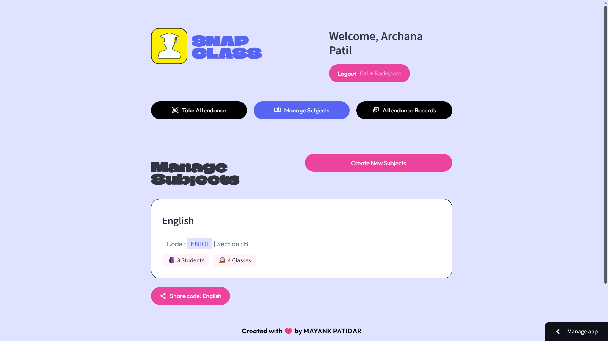
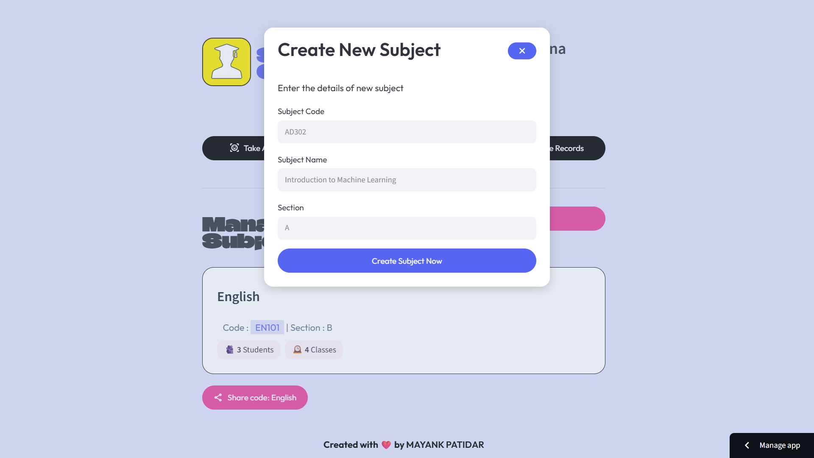

# 🚀 SnapClass Landing Page

Official landing page for **SnapClass – Multimodal AI Attendance Management Platform**.

This website serves as the public-facing entry point for SnapClass, showcasing the platform's capabilities, key features, screenshots, and providing access to the live attendance management application.

---

## 🌟 Overview

SnapClass is an AI-powered attendance management platform that combines **Face Recognition**, **Voice Verification**, and **QR-Based Enrollment** to automate classroom attendance and streamline academic workflows.

This landing page was designed to:

- Present the SnapClass product
- Showcase key platform features
- Display product screenshots
- Provide access to the live application
- Deliver a responsive experience across desktop and mobile devices

---

## 🛠 Tech Stack

- Python
- Flask
- HTML5
- CSS3
- Jinja2 Templates
- Responsive Web Design
- Vercel Deployment

---

## ✨ Key Features

- Modern Product Showcase
- Responsive Mobile-Friendly Design
- Interactive Feature Sections
- Product Demonstrations
- Teacher Dashboard Preview
- Student Dashboard Preview
- AI Attendance Workflow Showcase
- Direct Access to Live Application

---

## 📂 Project Structure

```text
.
├── static/
│   ├── css/
│   │   └── style.css
│   │
│   └── img/
│       └── demo/
│           ├── snap-landing.png
│           ├── teacher-dashboard.png
│           ├── student-dashboard.png
│           ├── qr-enrollment.png
│           ├── voice-attendance.png
│           └── attendance-reports.png
│
├── templates/
│   └── index.html
│
├── app.py
├── requirements.txt
└── README.md
```

---

# 📸 Product Showcase

## 🌐 Landing Page


## 👨‍🏫 Teacher Dashboard



## 📚 Subject Management



## 🔗 QR-Based Enrollment


## 🎤 Voice Attendance Verification


## 👤 Face Recognition Attendance


## 📊 Attendance Reports


---

## 🔗 Live Demo

### Landing Page

https://snap-class-landing-page-delta.vercel.app/

### Full Application

https://face-n-voice-attendance.streamlit.app/

---

## 🎯 Purpose

This repository contains the marketing and presentation website for SnapClass. The AI attendance engine, attendance workflows, and classroom management functionalities are available through the main SnapClass application.

---

## 👨‍💻 Author

**Mayank Patidar**

B.Tech Artificial Intelligence & Data Science  
LNCT Bhopal

GitHub: https://github.com/mayankptdr
